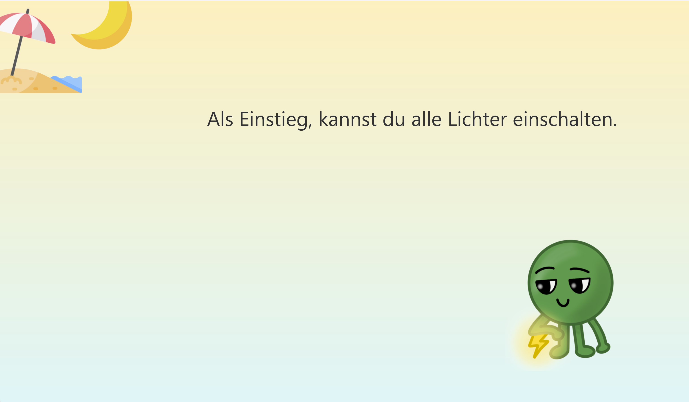
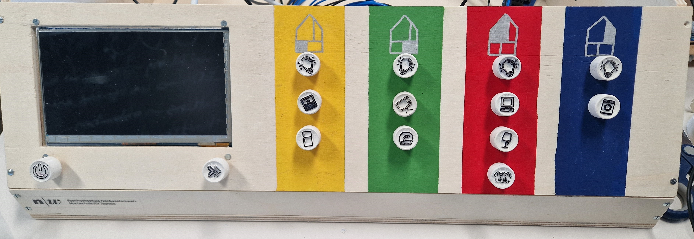

= Spielanleitung

== Einleitung und Ziel des Spiels

Im Spiel "Powerhouse" begleitet das Energiemonster Elektronix die Spieler*innen durch alle Levels.
Elektronix fühlt sich leider traurig, da im Haus zu viel Energie verschwendet wird.
Deshalb ist das Ziel des Spiels, die Stimmung von Elektronix zu verbessern, indem im Haus effizient Energie gespart wird.

Das Spiel besteht aus drei Schwierigkeitsgraden: einfach, mittel und schwer. Jede Schwierigkeit entspricht einem Tag.
Das Spiel findet ausschliesslich im Haus statt, um die Szenarien im echten Leben widerzuspiegeln und damit die Spieler*innen dies auch in ihrem Alltag umsetzen können. Es soll die Wichtigkeit des Umgangs mit Strom und Energie aufzeigen.

== Spielstart

Das Spiel startet mit einem Startbildschirm, der den Titel "Powerhouse" und Elektronix zeigt.
Zu Beginn wird ein kurzes Szenario präsentiert, in dem Elektronix seine Situation erklärt: Er ist traurig und hat kaum Energie,
weil im Haus zu viel Energie verschwendet wird.
Diese Einführung soll die Spieler*innen emotional mit Elektronix verbinden und die Bedeutung des Energiesparens verdeutlichen.

Die erste Aufgabe dient als Testaufgabe, bei der die Spieler*innen alle Lampen einschalten sollen. Diese Handlung hilft
nicht nur dabei, das grundlegende Ziel des Spiels – Energie zu sparen – zu verstehen, sondern gibt auch Elektronix die nötige
Energie, was sofortiges positives Feedback erzeugt. Parallel dazu wird eine interaktive Anleitung zur Steuerung eingeführt.
Spieler*innen lernen, wie sie das Schaltpult mit physischen Druckknöpfen und LED-Anzeigen für jedes Zimmer nutzen können.

Gleichzeitig wird das Energiebarometer eingeführt, das anzeigt, wie viel Energie bereits gespart wurde, beginnend bei 0 Punkten.
Das Barometer steigt bei jeder Aufgabe, die richtig gelöst wurde und sinkt, bei jeder falsch gelösten Aufgabe.

Nach erfolgreichem Abschluss der Testaufgabe und dem Kennenlernen der Steuerung beginnt das Spiel offiziell. Es folgen weitere Levels mit zunehmender Schwierigkeit, bei denen die Spieler*innen aufgefordert werden, in verschiedenen Szenarien des Haushalts strategisch Energie zu sparen.

=== Erklärung der Benutzeroberfläche und Steuerung

Auf dem Bildschirm erscheinen die Fragen mit der jeweiligen Jahreszeit und Tageszeit (Sommer, Winter, Tag und Nacht). Nach fast jedem Level ändern sich diese Zeiten. Sie werden als Icon in der linken oberen Ecke dargestellt.
Da jede Schwierigkeit einen Tag darstellt, wird auch nach jedem Tag eine neue Jahreszeit eingeführt (Sommer, Winter und wieder Sommer).

Für jedes Level wird auch ein Bild von Elektronix angezeigt, sodass die Spieler*innen visuell sehen können, wie sich Elektronix fühlt und welches Thema das Level hat.

Zudem wird auch angezeigt, ob eine Aufgabe richtig oder falsch gelöst wurde. Bei falschen Antworten erhält der/die Spieler*in die Lösung.
Am Ende des Spiels haben die Spieler*innen die Möglichkeit, das Spiel zu wiederholen.
Ein Energiebalken zeigt auch an, wie viel Energie gespart wurde. Bei einer richtigen Antwort steigt der Energiebalken, da Energie gespart wurde, während er bei einer falschen Antwort sinkt, da Energie verbraucht wurde.

Es gibt eine Möglichkeit, das Spiel jederzeit abzubrechen, weshalb bei einem Abbruch Elektronix gezeigt wird und das erreichte Energieersparnis.

Am Schaltpult sind 14 Knöpfe für alle Räume zu sehen, die mit einer grünen LED versehen sind. Mit diesen Knöpfen können Gegenstände ein- und ausgeschaltet werden, wobei diese entsprechend im Haus aufleuchten.
Zudem gibt es noch einen "Weiter"-Knopf, der gedrückt werden kann, wenn eine Aufgabe fertig gelesen oder ausgeführt wurde.
Der "Abbruch"-Knopf dient dazu, das Spiel zu beenden, falls die spielende Person nicht mehr spielen möchte.

Liste der Knöpfe und Räume von links nach rechts:
[cols="1,1" options="header"]
|===
|Raum |Gegenstände
|Küche (gelb) |Lampe, Fernseher/Spielkonsole, Aquarium
|Wohnzimmer (grün) |Lampe, Herd/Backofen, Kühlschrank
|Schlafzimmer (rot) |Lampe, Nachttischlampe, Computer, Heizung
|Badezimmer (blau) |Lampe, Waschmaschine/Trockner
|===

Jeder Knopf steuert ein spezifisches elektrisches Gerät im Haus. Das Ein- und Ausschalten dieser Geräte beeinflusst den
Energieverbrauch und damit die Punktzahl des Spielers.

Am Ende jedes Levels wird den Spielern die Wahl gelassen, ob sie mit dem nächsten Level fortfahren oder das Spiel beenden
möchten. Durch Betätigen des "Weiter"-Knopfs gelangt der Spieler zum nächsten Level, während der "Abbruch"-Knopf es ermöglicht, das Spiel jederzeit zu beenden und bei Bedarf neu zu starten.