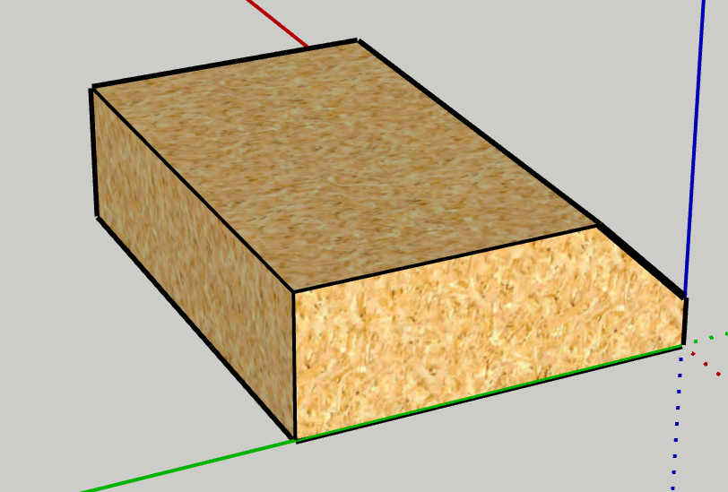
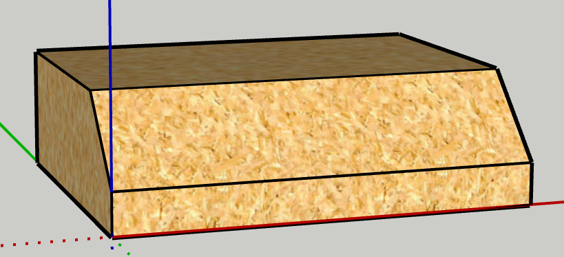
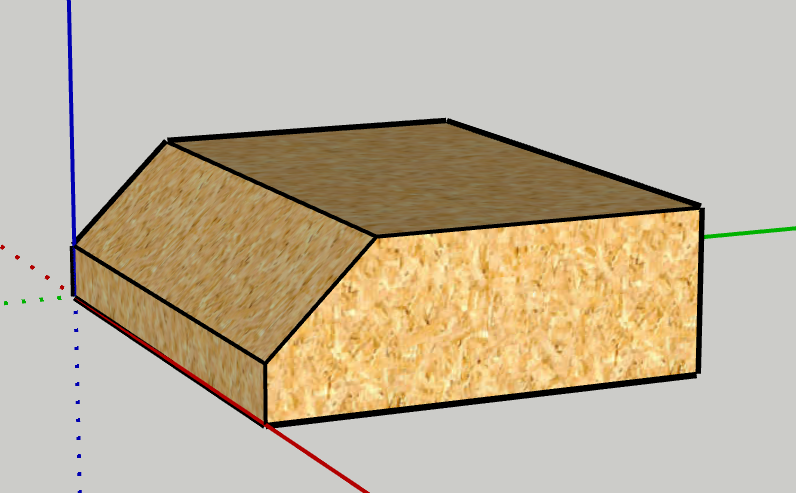
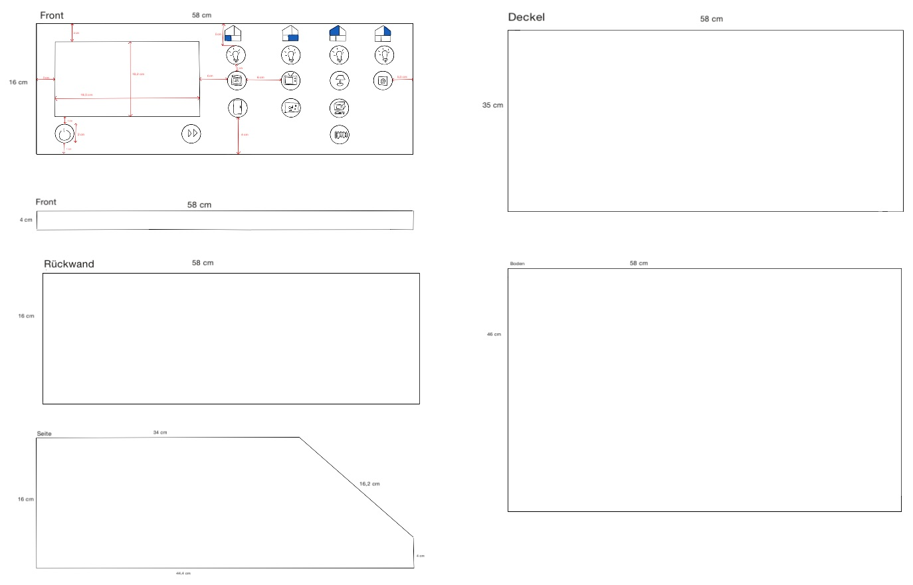

image::images/pi4j-header.png[]

_Hier stehen die Informationen zur Hardware._

Informationen zum Erstellen und Zusammenbauen finden sie hier: https://www.cs.technik.fhnw.ch/confluence20/display/IP1222vt/Material[]

*Teileliste Elektronik*
[cols="1,1,1,1" options="header"]
|===
|Produkt |Anzahl | Beschreibung |Einkaufsort
|Drucktaster|14 Stk.| Miniatur-Drucktaster|https://www.reichelt.com/ch/de/miniatur-drucktaster-0-5a-24vac-1x-ein-bl-t-250a-bl-p19983.html?&trstct=pol_6&nbc=1[Reichelt]
|Wiederstand | 12 Stk.| Wiederstand | -
|LED | 12 Stk.| LED, 5 mm, bedrahtet, grün, 39000 mcd, 15°| https://www.reichelt.com/ch/de/led-5-mm-bedrahtet-gruen-39000-mcd-15--led-5-39000-gn-p163989.html?&trstct=pol_6&nbc=1[Reichelt]
|Output Module | 2 Stk. | Kit I2C digital output Module| https://www.horter-shop.de/en/i2c-din-rail-modules/117-426-kit-i2c-digital-output-module-4260404260721.html#/25-terminals-fixed_terminals/27-pcf_type-pcf_8574_address_64_78[Horter & Kalb]

|===
*Teileliste Haus*
[cols="1,1,1,1" options="header"]
|===
|Produkt |Anzahl | Beschreibung |Einkaufsort
|Puppenhaus | 1 Stk. | FLISAT Puppenhaus, wurde auf Ricardo ersteigert für den halben Preis |https://www.ikea.com/ch/en/p/flisat-doll-s-house-wall-shelf-50290785/?&extProvId=5&extPu=14231-gaw&extLi=19645973180&extCr=144204905725-646967983869&keyword=&extSi=&gclid=Cj0KCQjwmvSoBhDOARIsAK6aV7jNImv6fXblVv1cl_UpcKnUJgISzAI6cJ2dv8hgdEuyqsAsxFkhmrwaAjVlEALw_wc[Ikea]
|Holz |1 Stk.| Sperrholz Pappel 8 mm dick |https://www.doitgarden.ch/de/p/640138700000/sperrholz-pappel[DO IT + GARDEN Migros]
|Hobbyglas |1 Stk. | Hobbyglas Transparent, 100 × 50 cm, 2 mm |https://www.jumbo.ch/de/bauen-renovieren/bedachungsmaterialien/kunststoff-wellplatten/hobbyglas-transparent--100--50-cm--2-mm/p/6057452[Jumbo]
|Kistengriffe |2 Stk. | Kistengriff Verzinkt Buntchrom, 100 × 80 × 15 mm |https://www.jumbo.ch/de/maschinen-werkstatt/beschlaege-briefkaesten/beschlaege/ueberfallen-riegel/kistengriff-verzinkt-buntchrom--100--80--15-mm/p/3446281[Jumbo]
|Scharniere |2 Stk. | Scharnier, 100 × 50 mm | Migros
|Universalschrauben | 6 Stk. |  Universalschraube Senkkopf, M 4 × 16 mm, inkl. Mutter | https://www.doitgarden.ch/de/p/601537000000/suki-universalschraube-senkkopf-4x16mm[Migros]
|Universalschrauben | 8 Stk. | Universalschrauben Pan-Head M 4 × 16 mm, inkl. Mutter und Unterlagsscheibe | https://www.doitgarden.ch/de/p/601543200000/suki-universalschraube-pan-head-4x16mm?gad_source=1&gclid=CjwKCAjwt-OwBhBnEiwAgwzrUv1ihWR-NH2P89awWpMCyD2LgIdVkKFS9p2nZIhwcFmln5gvPqd7GhoC-OsQAvD_BwE[Migros]
|Holzschrauben | 30 Stk. | Holzschrauben Linsenkopf verzinkt, 3 × 16 mm | -
|Klettverschluss | 2 Stk. | Klettverschluss selbstklebend, 18.5 x 1 cm| -
|Magnete | 7 Stk. | Magnete ⌀ 1 cm | -
|Blechscheiben | 7 Stk.| Blechscheiben ⌀ 2 cm | -

|===

*Abmessungen Holz für Schaltpult*
[cols="1,1,1" options="header"]
|===
|Teil |Länge |Breite
|Front für Knöpfe |58 cm |16 cm
|Front |58 cm | 4 cm
|Seite 2 Mal mit Abschrägung |44.4 cm |16 cm
|Deckel |58 cm |35 cm
|Boden |58 cm |46 cm
|Rückwand |58 cm |16 cm
|===

*Abmessungen Plexiglas*
[cols="1,1,1,1" options="header"]
|===
|Produkt |Höhe |Breite |Tiefe
|Front | 50 cm| 58 cm| 0.2 cm
|Aquarium Glas gross  |7 cm |2.5 cm |0.2 cm
|Aquarium Glas klein 2x  |2.5 cm |2.5 cm |0.2 cm
|Dusche | 10 cm |5 cm| 0.2 cm
|Dusche | 10 cm |2.5 cm| 0.2 cm
|Abdeckung Bildschirm | 18.5 cm | 13.5 cm | 0.2 cm
|===

*Abmessungen 3D-Druck Küche*
[cols="1,1,1,1,1" options="header"]
|===
|Produkt |Höhe z |Breite x|Tiefe y|Farbe
|Lampe|15,51 mm | 33,82 mm| 33,82 mm| a
|Herd/Backofen |51,76 mm |45 mm| 29,5 mm| transparent
|Kühlschrank|102,12 | 45 mm |39,02 mm| transparent
|Essisch|44,99 mm | 90 mm| 50,47 mm| weiss
|2x Stühle|69,86 mm |34 mm| 37,57 mm| weiss
|Küchenschrank|48 mm | 45 mm| 20 mm| weiss
|Küchenschranktüre| 44,67 mm | 36,66mm| 4 mm| weiss
|Waschbecken|51,76 mm  |40,69 mm |29,71 mm | weiss
|Dunstabzugshaube| 54 mm| 45 mm| 39,54 mm| schwarz
|===

*Abmessungen 3D-Druck Wohnzimmer*
[cols="1,1,1,1,1" options="header"]
|===
|Produkt |Höhe z |Breite x|Tiefe y|Farbe
|Lampe|15,51 mm | 33,82 mm| 33,82 mm| schwarz
|Fernseher|29,63 mm | 37 mm| 39,21 mm| transparent
|Aquarium Tisch| 27,84 mm| 75 mm| 27,84 mm| schwarz
|Aquarium Deckel| 3,8 mm| 75 mm| 27,84 mm| schwarz
|Aquarium Rahmen| 26,05 mm| 75 mm| 27,84 mm| schwarz
|Musikanlage|15,32 mm | 45 mm| 30,84 mm| transparent
|Sofa|45,6 mm | 90 mm| 61 mm| blau
|Fernsehtisch |33 mm | 75 mm| 40 mm| weisse Oberfläche, schwarze Beine
|Spielkonsole| 27,5 mm | 22,5 mm | 23,75 mm| aussen weiss, innen schwarz
|2x Vase| 20 mm | 12,48 mm | 12,48 mm| weiss
|===

*Abmessungen 3D-Druck Schlafzimmer*
[cols="1,1,1,1,1" options="header"]
|===
|Produkt |Höhe |Breite |Tiefe|Farbe
|Lampe|15,51 mm | 33,82 mm| 33,82 mm| transparent
|Computer|40,83 mm | 38 mm| 31 mm| transparent
|Heizung|49 mm | 11,2 mm| 70 mm| transparent
|Nachttisch|33 mm |40 mm| 30 mm| weinrot/braun
|Bürotisch|61,1 mm |90 mm |53,73 mm| weiss
|Bürostuhl|111,82 mm |50 mm| 48,89 mm| blau
|Nachttischlampe|46,77 mm | 30 mm| 30 mm| transparent
|Bett | 60 mm| 70 mm| 120 mm | weiss
|Kleiderschrank | 135 mm | 35 mm | 75 mm | weinrot/braun
|Bücherregal | 136,08 mm | 35 mm | 19,84 mm | weinrot/braun
|===

*Abmessungen 3D-Druck Badezimmer*
[cols="1,1,1,1,1" options="header"]
|===
|Produkt |Höhe |Breite |Tiefe|Farbe
|Lampe|15,51 mm | 33,82 mm| 33,82 mm| a
|Waschmaschine/Tumbler|48,91 mm | 45 mm| 50,66 mm| transparent
|WC| 61,92 mm| 45 mm| 27,13 mm| weiss
|Waschbecken|71,13 mm |45 mm| 30,06 mm| weiss
|Duschkopf |7,69 mm |9,62 mm| 20 mm| weiss
|===

